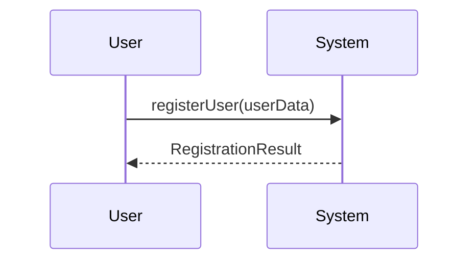

# 🎯 SSD Documentation - Quick Navigation Guide

## 📚 What You'll Find Here

This repository contains **complete System Sequence Diagram (SSD) documentation** for a Health Management Application, covering all 150 functional requirements from your SRS.

---

## 🚀 Start Here

### New to SSDs?
👉 **Start with:** [SSD_README.md](SSD_README.md)
- Quick overview of what's included
- How to use the documentation
- Tool recommendations

### Need Complete Documentation?
👉 **Go to:** [SYSTEM_SEQUENCE_DIAGRAMS.md](SYSTEM_SEQUENCE_DIAGRAMS.md)
- All 150 system operations
- Complete method signatures
- Parameter types and descriptions
- Return types
- Data type definitions

### Want Visual Examples?
👉 **Check out:** [SAMPLE_SSD_DIAGRAMS.md](SAMPLE_SSD_DIAGRAMS.md)
- 7 complete visual SSD examples
- PlantUML code snippets
- Mermaid diagrams
- Alternative flows

---

## 📖 Documentation Structure

```
📁 Repository
│
├── 📄 README.md (this file)
│   └── Main repository README with links
│
├── 📄 SSD_README.md (⭐ START HERE)
│   ├── Overview of all categories
│   ├── How to use the documentation
│   ├── Implementation notes
│   └── Tool recommendations
│
├── 📄 SYSTEM_SEQUENCE_DIAGRAMS.md (📚 REFERENCE)
│   ├── 2.2.1 Authentication (SRS-1 to SRS-30)
│   ├── 2.2.2 Profile Management (SRS-31 to SRS-61)
│   ├── 2.2.3 Medicine Management (SRS-62 to SRS-84)
│   ├── 2.2.4 Schedule Management (SRS-85 to SRS-88)
│   ├── 2.2.5 User Health Records (SRS-89 to SRS-96)
│   ├── 2.2.6 Inventory Control (SRS-97 to SRS-104)
│   ├── 2.2.7 Appointment Management (SRS-105 to SRS-116)
│   ├── 2.2.8 Journaling & Motivation (SRS-117 to SRS-125)
│   ├── 2.2.9 Report Management (SRS-126 to SRS-130)
│   ├── 2.2.10 ChatBot Assistant (SRS-131 to SRS-134)
│   ├── 2.2.11 Help & Support (SRS-135 to SRS-137)
│   ├── 2.2.12 Settings & Preferences (SRS-138 to SRS-144)
│   ├── 2.2.13 Analytics & Visualization (SRS-145 to SRS-150)
│   └── Data Type Definitions
│
└── 📄 SAMPLE_SSD_DIAGRAMS.md (🎨 EXAMPLES)
    ├── Example 1: User Registration Flow
    ├── Example 2: User Login Flow
    ├── Example 3: Add Medicine with Reminders
    ├── Example 4: Handle Notification Action
    ├── Example 5: Update Profile with BMI
    ├── Example 6: View Monthly Analytics
    ├── Example 7: Google Social Login
    ├── PlantUML Code Examples
    ├── Mermaid Diagram Examples
    └── Tool Comparison Guide
```

---

## 🎯 Quick Links by Task

### I want to understand the authentication system
➡️ [Authentication Section](SYSTEM_SEQUENCE_DIAGRAMS.md#221-authentication) in SYSTEM_SEQUENCE_DIAGRAMS.md
- Registration methods
- Login/Logout operations
- Password management
- Google OAuth integration

**See Example:** [User Registration Flow](SAMPLE_SSD_DIAGRAMS.md#example-1-user-registration-flow-srs-1-to-srs-7)

---

### I want to know how medicine management works
➡️ [Medicine Management Section](SYSTEM_SEQUENCE_DIAGRAMS.md#223-medicine-management) in SYSTEM_SEQUENCE_DIAGRAMS.md
- Add/Update medicines
- Complex scheduling
- Reminder notifications
- Categorization

**See Examples:** 
- [Add Medicine with Reminders](SAMPLE_SSD_DIAGRAMS.md#example-3-add-medicine-with-reminders-srs-62-to-srs-68)
- [Handle Notification Action](SAMPLE_SSD_DIAGRAMS.md#example-4-handle-medicine-notification-action-srs-74-to-srs-78)

---

### I want to implement profile management
➡️ [Profile Management Section](SYSTEM_SEQUENCE_DIAGRAMS.md#222-profile-management) in SYSTEM_SEQUENCE_DIAGRAMS.md
- View/Update profile
- Health information
- BMI calculation
- Photo upload

**See Example:** [Update Profile with BMI](SAMPLE_SSD_DIAGRAMS.md#example-5-update-profile-with-bmi-calculation-srs-38-to-srs-47)

---

### I want to design the analytics dashboard
➡️ [Analytics Section](SYSTEM_SEQUENCE_DIAGRAMS.md#2213-analytics--data-visualization) in SYSTEM_SEQUENCE_DIAGRAMS.md
- Consumption reports
- Missed doses tracking
- Monthly summaries

**See Example:** [View Monthly Analytics](SAMPLE_SSD_DIAGRAMS.md#example-6-view-monthly-analytics-summary-srs-145-to-srs-150)

---

### I want to integrate Google Login
➡️ [Social Login Section](SYSTEM_SEQUENCE_DIAGRAMS.md#2216-process-social-login) in SYSTEM_SEQUENCE_DIAGRAMS.md
- OAuth flow
- User creation
- Session management

**See Example:** [Google Social Login Flow](SAMPLE_SSD_DIAGRAMS.md#example-7-google-social-login-flow-srs-25-to-srs-30)

---

## 🛠️ How to Use This Documentation

### For Creating Visual Diagrams

1. **Choose your tool:**
   - PlantUML (text-based, great for version control)
   - Mermaid (GitHub compatible, renders in markdown)
   - Draw.io (visual editor, easy to use)
   - Lucidchart (professional, collaborative)

2. **Find the relevant section** in [SYSTEM_SEQUENCE_DIAGRAMS.md](SYSTEM_SEQUENCE_DIAGRAMS.md)

3. **Copy the method signatures** and parameters

4. **Use examples from** [SAMPLE_SSD_DIAGRAMS.md](SAMPLE_SSD_DIAGRAMS.md) as templates

5. **Adapt the code** for your specific tool

### For API Design

1. **Review method signatures** in [SYSTEM_SEQUENCE_DIAGRAMS.md](SYSTEM_SEQUENCE_DIAGRAMS.md)

2. **Map methods to REST endpoints:**
   ```
   registerUser() → POST /api/auth/register
   loginUser() → POST /api/auth/login
   updateProfile() → PUT /api/profile
   addMedicine() → POST /api/medicines
   ```

3. **Use data types** for request/response schemas

4. **Reference SRS numbers** in API documentation

### For Database Design

1. **Extract data types** from [SYSTEM_SEQUENCE_DIAGRAMS.md](SYSTEM_SEQUENCE_DIAGRAMS.md)

2. **Create tables based on:**
   - `UserData`
   - `MedicineData`
   - `AppointmentData`
   - `ProfileData`
   - etc.

3. **Add relationships** based on method parameters

4. **Include validation rules** from SRS requirements

### For Implementation

1. **Start with one category** (e.g., Authentication)

2. **Implement each method** according to signature

3. **Use type definitions** for data structures

4. **Follow internal processing steps** shown in examples

5. **Test each operation** against SRS requirements

---

## 📊 Statistics

- **Total SRS Requirements Covered:** 150
- **Total System Operations Documented:** 120+
- **Total Data Types Defined:** 25+
- **Sample Visual Diagrams:** 7
- **PlantUML Examples:** 2
- **Mermaid Examples:** 2
- **Total Lines of Documentation:** 3,000+

---

## 🎨 Creating Visual Diagrams

### Option 1: PlantUML (Recommended for Developers)

**Installation:**
```bash
# On Ubuntu/Debian
sudo apt-get install plantuml

# On macOS
brew install plantuml

# Or use online: http://www.plantuml.com/plantuml/
```

**Usage:**
```bash
# Copy PlantUML code from SAMPLE_SSD_DIAGRAMS.md
# Save to file: registration.puml
# Generate diagram:
plantuml registration.puml
```

### Option 2: Mermaid (GitHub Compatible)

**Usage:**
```markdown
<!-- In GitHub markdown, wrap in ```mermaid code block -->

<!-- GitHub will render it automatically -->
```

**Live Editor:** https://mermaid.live/

### Option 3: Draw.io (Visual Editor)

1. Go to https://app.diagrams.net/
2. Create new diagram → UML → Sequence Diagram
3. Use method names from documentation
4. Add actors, lifelines, and messages

### Option 4: Lucidchart (Professional)

1. Sign up at https://www.lucidchart.com/
2. Create UML Sequence Diagram
3. Use documentation as reference
4. Collaborate with team

---

## ✅ Checklist: What You Can Do Now

- [ ] Read [SSD_README.md](SSD_README.md) for overview
- [ ] Browse [SYSTEM_SEQUENCE_DIAGRAMS.md](SYSTEM_SEQUENCE_DIAGRAMS.md) sections relevant to your task
- [ ] Review [SAMPLE_SSD_DIAGRAMS.md](SAMPLE_SSD_DIAGRAMS.md) for visual examples
- [ ] Choose a diagramming tool
- [ ] Create your first visual SSD using the examples
- [ ] Design API endpoints based on method signatures
- [ ] Plan database schema using data types
- [ ] Start implementation following the documentation

---

## 🎓 Learning Resources

### Understanding SSDs
- **What is an SSD?** A System Sequence Diagram shows interactions between users and the system
- **Why use SSDs?** To visualize system operations and data flow
- **When to use?** During design phase, before implementation

### UML Sequence Diagrams
- [UML Basics](https://www.uml.org/)
- [Sequence Diagram Tutorial](https://www.visual-paradigm.com/guide/uml-unified-modeling-language/what-is-sequence-diagram/)
- [PlantUML Documentation](https://plantuml.com/sequence-diagram)
- [Mermaid Documentation](https://mermaid.js.org/syntax/sequenceDiagram.html)

---

## 🤝 Support

### Need Clarification?
- Check the **Related SRS** references in each method
- Review the **Data Type Definitions** section
- Look at **Sample Visual Diagrams** for context

### Found an Issue?
- Verify against original SRS requirements
- Check data type definitions
- Review method parameters and return types

### Want to Extend?
- Follow existing naming conventions
- Add new methods in appropriate sections
- Update data type definitions
- Create sample diagrams for new flows

---

## 📌 Key Conventions

### Naming
- **Methods:** camelCase (e.g., `registerUser`)
- **Parameters:** camelCase (e.g., `userData`)
- **Types:** PascalCase (e.g., `UserRegistrationData`)
- **Constants:** UPPER_SNAKE_CASE (e.g., `MAX_PASSWORD_LENGTH`)

### Data Flow
- **Input:** Always validate before processing
- **Processing:** Show internal steps in SSDs
- **Output:** Return structured result objects
- **Errors:** Include in result objects, not exceptions

### Security
- **Passwords:** Always hash before storage
- **Sessions:** Use secure tokens (JWT)
- **APIs:** Validate all inputs
- **Storage:** Encrypt sensitive data

---

## 🎯 Next Steps

1. **Review Documentation** ✅
2. **Create Visual Diagrams** 
3. **Design APIs**
4. **Plan Database**
5. **Implement System**
6. **Test Against SRS**
7. **Deploy**

---

## 📝 Version History

- **v1.0** - December 2025
  - Complete SSD documentation for all 150 SRS requirements
  - 7 sample visual diagrams
  - PlantUML and Mermaid examples
  - Comprehensive data type definitions

---

## 📮 Feedback

This documentation is designed to be comprehensive and practical. If you find areas for improvement or have questions, please refer to the detailed sections in the main documentation files.

---

**Happy Diagramming! 🎨**

---

**Quick Reference Card**

| What I Need | Where to Find It |
|-------------|------------------|
| Overview | [SSD_README.md](SSD_README.md) |
| Method Signatures | [SYSTEM_SEQUENCE_DIAGRAMS.md](SYSTEM_SEQUENCE_DIAGRAMS.md) |
| Visual Examples | [SAMPLE_SSD_DIAGRAMS.md](SAMPLE_SSD_DIAGRAMS.md) |
| Data Types | [SYSTEM_SEQUENCE_DIAGRAMS.md#data-type-definitions](SYSTEM_SEQUENCE_DIAGRAMS.md#data-type-definitions) |
| PlantUML Code | [SAMPLE_SSD_DIAGRAMS.md#plantuml-code-examples](SAMPLE_SSD_DIAGRAMS.md#plantuml-code-examples) |
| Mermaid Code | [SAMPLE_SSD_DIAGRAMS.md#mermaid-diagram-examples](SAMPLE_SSD_DIAGRAMS.md#mermaid-diagram-examples) |
| Tool Comparison | [SAMPLE_SSD_DIAGRAMS.md#tools-comparison](SAMPLE_SSD_DIAGRAMS.md#tools-comparison) |

---

*Documentation Version 1.0 - Created December 2025*
