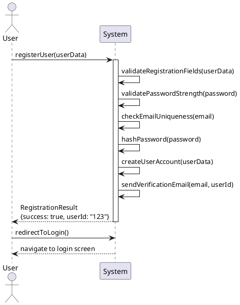
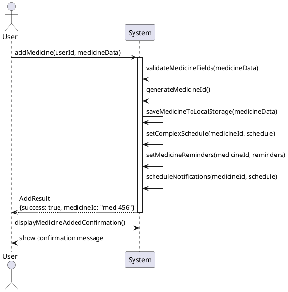
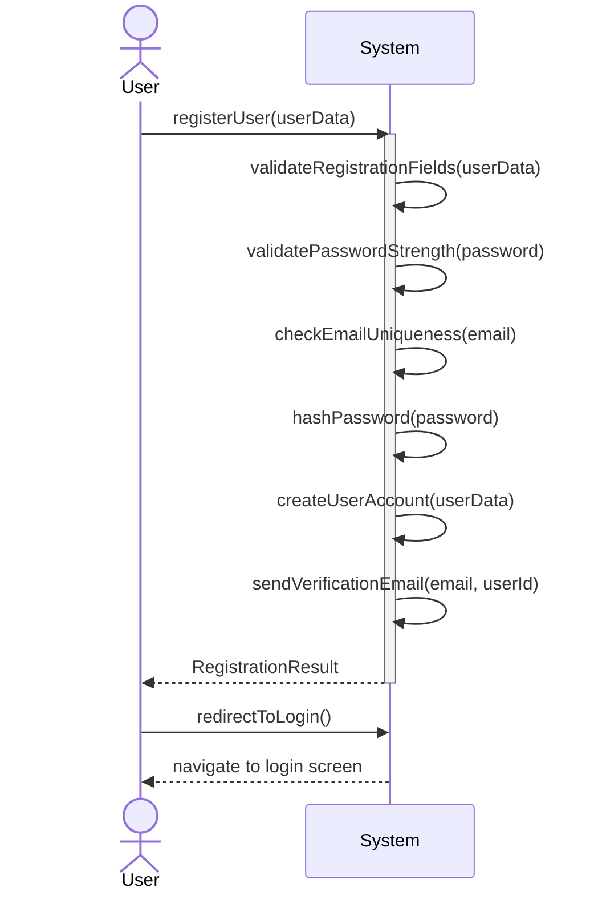
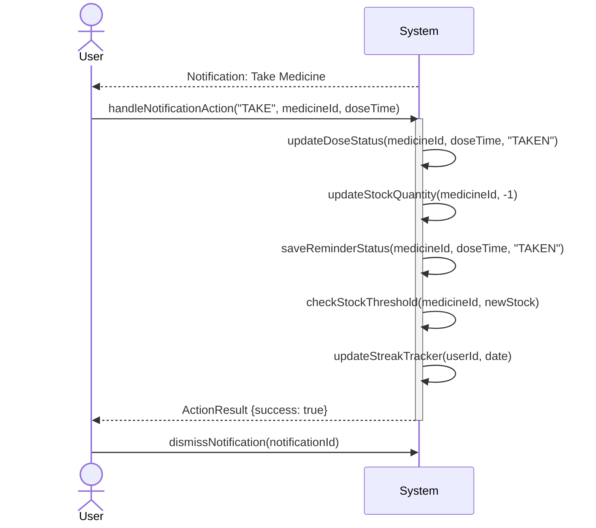

# Sample System Sequence Diagrams (SSD)

This document provides example System Sequence Diagrams for common user flows to demonstrate how to create visual SSDs using the methods from [SYSTEM_SEQUENCE_DIAGRAMS.md](SYSTEM_SEQUENCE_DIAGRAMS.md).

---

## Example 1: User Registration Flow (SRS-1 to SRS-7)

### Visual Representation

```
User                                    System
 |                                         |
 |-- 1. registerUser(userData) ---------->|
 |                                         |
 |                                         |-- 1.1: validateRegistrationFields(userData)
 |                                         |    [check all required fields]
 |                                         |
 |                                         |-- 1.2: validatePasswordStrength(password)
 |                                         |    [min 8 chars, 1 uppercase, 1 number]
 |                                         |
 |                                         |-- 1.3: checkEmailUniqueness(email)
 |                                         |    [query database]
 |                                         |
 |                                         |-- 1.4: hashPassword(password)
 |                                         |    [secure hashing]
 |                                         |
 |                                         |-- 1.5: createUserAccount(userData)
 |                                         |    [save to database]
 |                                         |
 |                                         |-- 1.6: sendVerificationEmail(email, userId)
 |                                         |    [send email with link]
 |                                         |
 |<---------- RegistrationResult ---------|
 |    {success: true, userId: "123", 
 |     message: "Account created"}
 |                                         |
 |-- 2. redirectToLogin() --------------->|
 |                                         |
 |<---- navigate to login screen ---------|
 |                                         |
```

### Method Details

**Main Operation:**
```typescript
registerUser(userData: UserRegistrationData): RegistrationResult
```

**Input:**
```typescript
userData = {
  fullName: "John Doe",
  email: "john.doe@example.com",
  password: "SecurePass123",
  confirmPassword: "SecurePass123"
}
```

**Output:**
```typescript
RegistrationResult = {
  success: true,
  userId: "user-uuid-123",
  message: "Registration successful. Please check your email."
}
```

**Related SRS:** SRS-1, SRS-2, SRS-3, SRS-4, SRS-5, SRS-6, SRS-7

---

## Example 2: User Login Flow (SRS-8 to SRS-11)

### Visual Representation

```
User                                    System
 |                                         |
 |-- 1. loginUser(credentials) ---------->|
 |                                         |
 |                                         |-- 1.1: validateCredentials(email, password)
 |                                         |    [check email exists]
 |                                         |    [verify hashed password]
 |                                         |
 |                                         |-- 1.2: createSessionToken(userId)
 |                                         |    [generate JWT token]
 |                                         |
 |<------------- LoginResult -------------|
 |    {success: true, userId: "123",
 |     sessionToken: "jwt-token",
 |     message: "Login successful"}
 |                                         |
 |-- 2. redirectToDashboard(userId) ----->|
 |                                         |
 |<----- navigate to dashboard ------------|
 |                                         |
```

### Alternative Flow: Invalid Credentials

```
User                                    System
 |                                         |
 |-- 1. loginUser(credentials) ---------->|
 |                                         |
 |                                         |-- 1.1: validateCredentials(email, password)
 |                                         |    [email not found OR password mismatch]
 |                                         |
 |<------------- LoginResult -------------|
 |    {success: false,
 |     message: "Invalid email or password"}
 |                                         |
 |-- 2. displayLoginError("INVALID") ---->|
 |                                         |
 |<----- show error message --------------|
 |                                         |
```

**Related SRS:** SRS-8, SRS-9, SRS-10, SRS-11

---

## Example 3: Add Medicine with Reminders (SRS-62 to SRS-68)

### Visual Representation

```
User                                        System
 |                                             |
 |-- 1. addMedicine(userId, medicineData) --->|
 |                                             |
 |                                             |-- 1.1: validateMedicineFields(medicineData)
 |                                             |    [check required fields]
 |                                             |
 |                                             |-- 1.2: generateMedicineId()
 |                                             |    [create unique ID]
 |                                             |
 |                                             |-- 1.3: saveMedicineToLocalStorage(medicineData)
 |                                             |    [persist medicine]
 |                                             |
 |                                             |-- 1.4: setComplexSchedule(medicineId, schedule)
 |                                             |    [configure schedule pattern]
 |                                             |
 |                                             |-- 1.5: setMedicineReminders(medicineId, reminders)
 |                                             |    [create notification schedule]
 |                                             |
 |                                             |-- 1.6: scheduleNotifications(medicineId, schedule)
 |                                             |    [register with notification system]
 |                                             |
 |<---------------- AddResult -----------------|
 |    {success: true, 
 |     medicineId: "med-uuid-456",
 |     message: "Medicine added successfully"}
 |                                             |
 |-- 2. displayMedicineAddedConfirmation() -->|
 |                                             |
 |<------- show confirmation message ----------|
 |                                             |
```

### Method Details

**Main Operation:**
```typescript
addMedicine(userId: string, medicineData: MedicineData): AddResult
```

**Input:**
```typescript
medicineData = {
  name: "Aspirin",
  dosage: "100mg",
  frequency: {
    timesPerDay: 2,
    times: ["09:00", "21:00"]
  },
  reminders: [
    { time: "08:55", offset: -5, enabled: true },
    { time: "09:00", offset: 0, enabled: true },
    { time: "09:02", offset: 2, enabled: true }
  ],
  initialStock: 30,
  category: "Tablet",
  schedule: {
    type: "SPECIFIC_DAYS",
    daysOfWeek: ["MON", "WED", "FRI"]
  }
}
```

**Related SRS:** SRS-62, SRS-63, SRS-64, SRS-65, SRS-66, SRS-67, SRS-68

---

## Example 4: Handle Medicine Notification Action (SRS-74 to SRS-78)

### Visual Representation

```
User                                            System
 |                                                 |
 |<---------- Notification Triggered --------------|
 |    [Medicine: Aspirin, Time: 09:00]
 |    [Actions: Take | Missed | Snooze]
 |                                                 |
 |-- 1. handleNotificationAction(notificationId, --|
 |        "TAKE", medicineId, doseTime) ---------->|
 |                                                 |
 |                                                 |-- 1.1: updateDoseStatus(medicineId, doseTime, "TAKEN")
 |                                                 |    [mark as taken]
 |                                                 |
 |                                                 |-- 1.2: updateStockQuantity(medicineId, -1)
 |                                                 |    [decrease stock by 1]
 |                                                 |
 |                                                 |-- 1.3: saveReminderStatus(medicineId, doseTime, "TAKEN")
 |                                                 |    [persist status]
 |                                                 |
 |                                                 |-- 1.4: checkStockThreshold(medicineId, newStock)
 |                                                 |    [check if low stock]
 |                                                 |
 |                                                 |-- 1.5: updateStreakTracker(userId, date)
 |                                                 |    [update adherence streak]
 |                                                 |
 |<----------------- ActionResult -----------------|
 |    {success: true, 
 |     newStatus: "TAKEN",
 |     message: "Dose logged successfully"}
 |                                                 |
 |-- 2. dismissNotification(notificationId) ----->|
 |                                                 |
```

### Alternative Flow: Snooze Action

```
User                                            System
 |                                                 |
 |-- 1. handleNotificationAction(notificationId, --|
 |        "SNOOZE", medicineId, doseTime) -------->|
 |                                                 |
 |                                                 |-- 1.1: calculateSnoozeTime(currentTime, 10)
 |                                                 |    [add 10 minutes]
 |                                                 |
 |                                                 |-- 1.2: rescheduleNotification(medicineId, snoozeTime)
 |                                                 |    [create new notification]
 |                                                 |
 |                                                 |-- 1.3: saveReminderStatus(medicineId, doseTime, "SNOOZED")
 |                                                 |    [persist status]
 |                                                 |
 |<----------------- ActionResult -----------------|
 |    {success: true, 
 |     newStatus: "SNOOZED",
 |     snoozeTime: "09:10"}
 |                                                 |
```

**Related SRS:** SRS-74, SRS-75, SRS-76, SRS-77, SRS-78

---

## Example 5: Update Profile with BMI Calculation (SRS-38 to SRS-47)

### Visual Representation

```
User                                        System
 |                                             |
 |-- 1. updateProfile(userId, profileData) -->|
 |                                             |
 |                                             |-- 1.1: validateProfileData(profileData)
 |                                             |    [check field formats]
 |                                             |
 |                                             |-- 1.2: recalculateBMI(weight, height)
 |                                             |    [BMI = weight / (height/100)²]
 |                                             |    [weight: 70kg, height: 175cm]
 |                                             |    [BMI = 70 / 1.75² = 22.86]
 |                                             |
 |                                             |-- 1.3: profileData.bmi = calculatedBMI
 |                                             |    [add BMI to profile]
 |                                             |
 |                                             |-- 1.4: saveProfileToFirebase(userId, profileData)
 |                                             |    [persist to cloud]
 |                                             |
 |<-------------- UpdateResult ----------------|
 |    {success: true, 
 |     updatedFields: ["weight", "height", "bmi"],
 |     message: "Profile updated successfully"}
 |                                             |
 |-- 2. displayUpdateConfirmation(message) -->|
 |                                             |
 |<------- show success message ---------------|
 |                                             |
```

**Related SRS:** SRS-38, SRS-40, SRS-41, SRS-44, SRS-46, SRS-47

---

## Example 6: View Monthly Analytics Summary (SRS-145 to SRS-150)

### Visual Representation

```
User                                            System
 |                                                 |
 |-- 1. generateMonthlySummary(userId, -----------|
 |        month: 12, year: 2025) ----------------->|
 |                                                 |
 |                                                 |-- 1.1: getDoseHistoryForMonth(userId, 12, 2025)
 |                                                 |    [query all doses for December]
 |                                                 |
 |                                                 |-- 1.2: calculateTakenDoses(doseHistory)
 |                                                 |    [count TAKEN status]
 |                                                 |
 |                                                 |-- 1.3: calculateMissedDoses(doseHistory)
 |                                                 |    [count MISSED status]
 |                                                 |
 |                                                 |-- 1.4: identifyIrregularIntake(doseHistory)
 |                                                 |    [find patterns of inconsistency]
 |                                                 |
 |                                                 |-- 1.5: generateIntakeChart(takenDoses)
 |                                                 |    [create chart data]
 |                                                 |
 |                                                 |-- 1.6: generateMissedChart(missedDoses)
 |                                                 |    [create chart data]
 |                                                 |
 |<----------- MonthlySummaryData ----------------|
 |    {
 |      intakeChart: {...},
 |      missedChart: {...},
 |      statistics: {
 |        totalDoses: 60,
 |        takenDoses: 54,
 |        missedDoses: 6,
 |        adherenceRate: 90%
 |      }
 |    }
 |                                                 |
 |-- 2. displayMonthlyCharts(summaryData) ------->|
 |                                                 |
 |<------- render charts and statistics -----------|
 |                                                 |
```

**Related SRS:** SRS-145, SRS-146, SRS-147, SRS-148, SRS-149, SRS-150

---

## Example 7: Google Social Login Flow (SRS-25 to SRS-30)

### Visual Representation

```
User                    System              Google OAuth
 |                         |                      |
 |-- 1. initiateGoogleLogin() -->|                |
 |                         |                      |
 |                         |-- 1.1: redirect to ->|
 |                         |      Google OAuth    |
 |                         |                      |
 |<------------------ Google Login Screen --------|
 |                         |                      |
 |-- enter credentials --->|--------------------->|
 |                         |                      |
 |                         |<-- authCode ---------|
 |                         |                      |
 |                         |-- 1.2: handleGoogleAuthCallback(authCode)
 |                         |                      |
 |                         |-- 1.3: exchangeCodeForToken(authCode)
 |                         |--------------------->|
 |                         |                      |
 |                         |<-- accessToken ------|
 |                         |                      |
 |                         |-- 1.4: retrieveGoogleUserInfo(accessToken)
 |                         |--------------------->|
 |                         |                      |
 |                         |<-- GoogleUserData ---|
 |                         |    {fullName, email, 
 |                         |     profilePhoto}
 |                         |                      |
 |                         |-- 1.5: checkIfUserExists(email)
 |                         |    [query database]
 |                         |                      |
 |                         |-- IF NOT EXISTS:
 |                         |    1.6: createGoogleUser(googleData)
 |                         |         [save to database]
 |                         |         [mark authType: "GOOGLE"]
 |                         |                      |
 |                         |-- 1.7: loginExistingGoogleUser(email)
 |                         |    [create session]
 |                         |                      |
 |                         |-- 1.8: disablePasswordChange(userId)
 |                         |    [set flag: canChangePassword = false]
 |                         |                      |
 |<-------- LoginResult ---|                      |
 |    {success: true,
 |     userId: "123",
 |     sessionToken: "jwt"}
 |                         |                      |
 |-- 2. redirectToHomeScreen(userId) ------------>|
 |                         |                      |
 |<----- navigate to home --|                      |
 |                         |                      |
```

**Related SRS:** SRS-25, SRS-26, SRS-27, SRS-28, SRS-29, SRS-30

---

## PlantUML Code Examples

### Example 1: Registration (for PlantUML tool)



### Example 2: Add Medicine (for PlantUML tool)



---

## Mermaid Diagram Examples

### Example 1: Registration (for Mermaid)



### Example 2: Handle Notification (for Mermaid)



---

## Key Notation Elements

### Actors
- **User**: The person interacting with the system
- **System**: The application/backend
- **External Systems**: Google OAuth, Firebase, Gemini API, etc.

### Messages
- **Solid arrow (→)**: Synchronous method call
- **Dashed arrow (⤺)**: Return value
- **Activation box**: Vertical bar showing object is active

### Message Format
```
methodName(parameter1, parameter2): ReturnType
```

### Internal Processing
- Shown as `System -> System: internalMethod()`
- Represents internal validation, calculation, or data processing

---

## Tips for Creating Visual SSDs

1. **Start Simple**: Begin with the main user action
2. **Show Internal Logic**: Include key validation and processing steps
3. **Include Return Values**: Show what data flows back to the user
4. **Use Consistent Naming**: Match method names from the documentation
5. **Add Notes**: Annotate complex logic with comments
6. **Show Alternatives**: Create separate diagrams for error flows
7. **Keep it Readable**: Don't overcrowd a single diagram

---

## Tools Comparison

| Tool | Pros | Cons | Best For |
|------|------|------|----------|
| **PlantUML** | Text-based, version control friendly | Learning curve | Developers |
| **Mermaid** | Markdown integration, GitHub support | Limited styling | Documentation |
| **Draw.io** | Visual, intuitive, free | Manual layout | Quick diagrams |
| **Lucidchart** | Professional, collaborative | Paid | Teams |
| **Visual Paradigm** | Complete UML support | Complex, expensive | Enterprise |

---

For complete method signatures and data types, refer to [SYSTEM_SEQUENCE_DIAGRAMS.md](SYSTEM_SEQUENCE_DIAGRAMS.md).

**Document Version:** 1.0  
**Created:** December 2025
